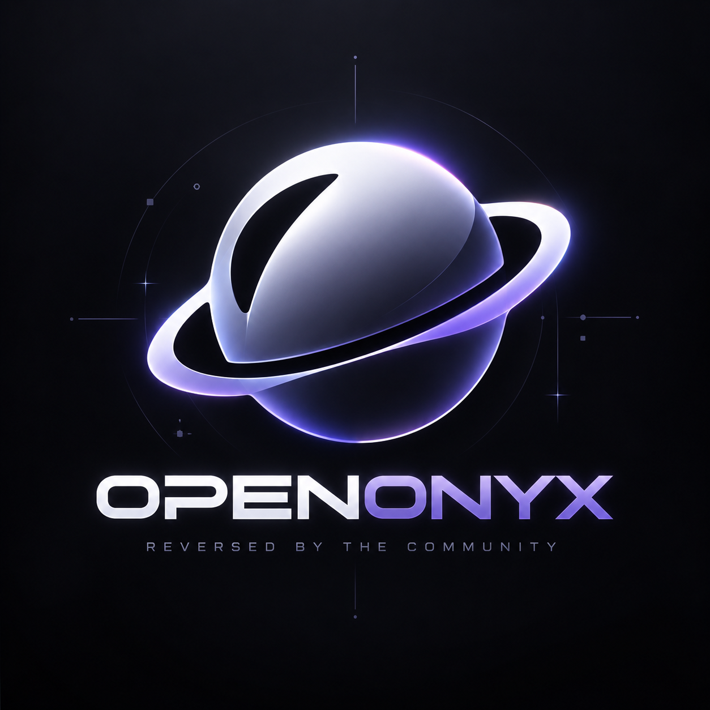
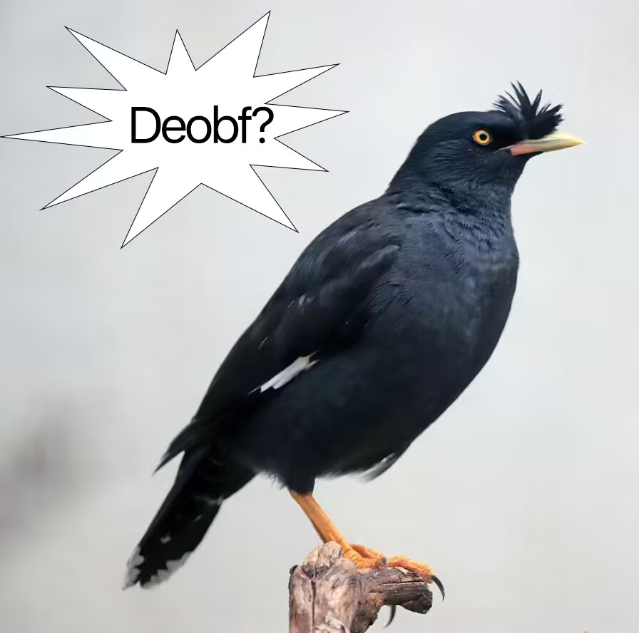

# Onyx but... Open Source

<p align="center">
  
</p>

<p align="center">
  
  
</p>

- JDK 21 (the supplied runtime is Temurin 21.0.4)
- Java decompiler / bytecode tooling for regeneration
- highiq

## build status

The recovered tree is a decompiler output and is not currently a reproducible
source build. `gradle compileJava` was tested with JDK 21 and fails on CFR
artifacts such as invalid `void` locals and corrupted constructor parameters.
The supplied binary remains runnable with its bundled Temurin 21.0.4 runtime;
that binary is intentionally not part of the source-only repository.

## static security review

The supplied `onyx.jar` and renamed archive were reviewed without executing
them or making network requests:

- No persistence, startup registration, native loading, arbitrary class loading,
  RAT command channel, webhook, Discord bot token, or credential-file harvesting
  was identified.
- Network code targets Microsoft/Xbox/Minecraft authentication, Mojang skin
  lookup, configured Minecraft proxies, and Discord's local IPC socket.
- The only local HTTP listener is the loopback OAuth callback on
  `127.0.0.1:1337`.
- `ProcessBuilder` is used by the optional Windows Spotify/media integration to
  invoke a fixed temporary PowerShell script, and by the macOS integration to
  invoke a fixed AppleScript. These paths read now-playing metadata and cover
  art; they are not remote command execution.
- File access is limited to client configuration, temporary media integration
  files, and user-selected UI/configuration files. Clipboard reads/writes are
  used by the UI.

This is a static review, not a guarantee against behavior that only appears
under an unobserved runtime condition.

## what is included

This repository contains the recovered OpenOnyx source tree from the supplied
JAR. The source is organized by responsibility instead of the original
obfuscated package layout:

- `openonyx.features.combat`
- `openonyx.features.movement`
- `openonyx.features.player`
- `openonyx.features.render`
- `openonyx.features.hud`
- `openonyx.history`
- `openonyx.configuration`
- `openonyx.events`
- `openonyx.utilities`

Feature and support classes have purpose-based names, including:

```text
KillAura, AntiBot, Velocity, BedBreaker, BedDefender
Scaffold, ChestStealer, InventoryManager, NameChanger
ESP, BedESP, Fullbright, NoRender, Chams, Camera
Module, ModuleManager, ModuleCategory
PacketEvent, TickEvent, WorldChangeEvent
RotationManager, Rotation, AimController, CombatController
BooleanSetting, NumberSetting, EnumSetting, MultiSelectSetting
```

The recovered `KillAura` implementation now exposes readable members such as
`combatController`, `aimController`, `targetFilters`, `autoBlockMode`,
`targetDistance`, `findTarget`, `shouldAttack`, `attackIfReady`, and
`onPacket`.

## recovery notes

- 630 original JVM classes were parsed.
- Source recovery produced 432 Java files.
- The supplied ZKM tool found no ZKM DES or long-key protection in the archive.
- Local XOR string decoder calls were resolved where their inputs and runtime
  dependencies allowed static recovery.
- The no-op obfuscation marker and its bytecode call sites were removed from the
  renamed output.

This is decompiled source, not a clean-room rewrite. Compiler metadata,
original comments, exact local names, and some control-flow structure were not
present in the input. Review the recovered code before using it as a build.

## decompilation

The original archive is kept separately from the recovered source. The source
recovery process uses CFR 0.152 with the libraries shipped under `rt/libs/`.
`tools/RenameClasses.java` performs the offline ASM class/package remap and
writes the original-to-recovered map to `mappings/classes.tsv`.

## contributing

Contributions, cleanup patches, semantic renames, and bug reports are welcome.
Open an issue or submit a pull request on Codeberg.

## legal

OpenOnyx is an independent community project and is not an official Minecraft
product. Minecraft is a trademark of Mojang Studios and Microsoft Corporation.
Third-party files and libraries retain their respective licenses.
